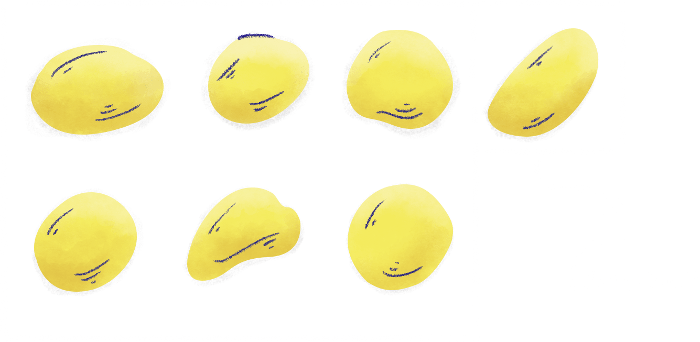
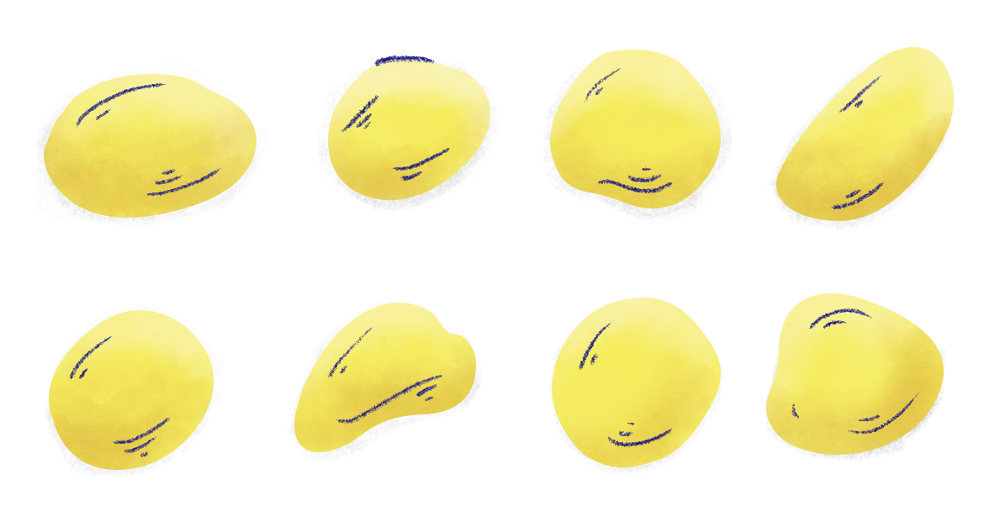
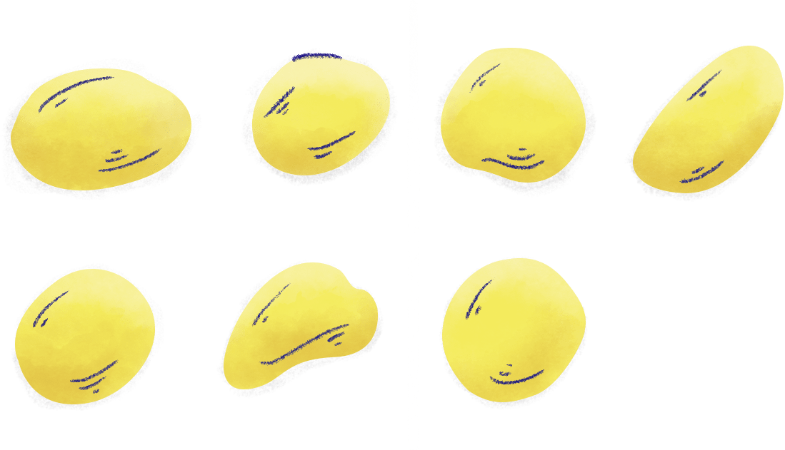

The projecting piece on a sundial that shows the time by the position of its shadow, is called a Gnomon.


Gnomon, like “Hat,” is just an English word; it’s not a specific term for a piece of sundial’s anatomy. For example, Gnomon is also the word the Greeks used for odd numbers. Possibly because of the following observation.

If you were to take an odd number of things, say 7 pebbles, and lay them out in two rows…


… you will notice a pebble projecting out of an otherwise even shape. Forming a Gnomon.



And conversely, if you lay an even number of pebbles, say 8, in two rows, you’ll find an _even_ rectangular shape.



This is supposedly the origin of the concept of even and odd numbers, or of their names at least.

Much later, Euclid, a Math grandmaster, formalized even numbers as: “An even number is that which is divisible into two equal parts.” And the numbers that cannot be divided into two equal parts are odd.




---

If you have ever written a computer program that checks whether a number is even, you have — maybe without knowing — eluded to Euclid’s definition of even numbers.

```javascript
let isEven = function (number) {
  // If the number is divisible by 2, or, in other words
  // If the number when divided by 2 leaves no remainder
  if (number % 2 === 0) {
    return true // it is an even number
  } else {
    return false // it is not
  }
}
```

Before we move forward, let’s be honest, the code you see above is unnecessarily verbose. It can be written more succinctly like so:

```javascript
let isEven = function (number) {
  return number % 2 === 0
}
```

And that’s exactly how you should be writing your code. But I want the book and the code written in it to be readable by programmers at all levels. If anywhere in the book, you think there’s a better way to write the same code, don’t hold yourself back.

Returning to our discussion about even and odd numbers, let’s consider the number `0`, we know that `0` is an even number as it is divisible by `2`, `(0/2 = 0)`. Now what we can do with `0` is use it as an anchor in the natural sequence of numbers, starting from which the even and odd numbers alternate.


There are two rudimentary observations we can extract from this sequence:

1. Any number `n` is even if it is either `0` or if the number just before `n` is odd.
2. A number is odd if it’s not even.

Let’s start with the first observation.

The observation is, if you pick any random number in the sequence, it is even only if it is `0` or the number before the chosen number is odd.

Take `8`, for example. Is `8` even? For _that_, it has to pass at least one of the two checks.

1. Is `8` `0`? No, `8` is not `0`, `8` is `8`! — Check failed!
2. Is the number before `8` `(8–1 = 7)` odd? Yes, `7` is an odd number!

Since one of the checks pass, `8`, in fact, is an even number.

Translating this into code we get,

```javascript
let isEven = function (number) {
  // A number is even if it is either 0...
  if (number === 0) {
    return true
    // ...or The number preceding it (i.e. number - 1)is odd ...
  } else {
    if (isOdd(number - 1)) {
      return true
    } // ..is odd.
  }
}
```

What’s missing here is we don’t have a `isOdd` function yet. So what? Let’s go ahead and write one. Our 2nd insight (A number is odd if it’s not even) will be helpful.

```javascript
let isOdd = function (number) {
  // if a number is not even (notice the !, ! = not)
  if (!isEven(number)) {
    return true // then it's odd
  } else {
    // otherwise
    return false // it's even
  }
}
```

“That’s a kind of a spooky way to write code, isn’t it, Nash?” Yes, it does seem like it. Let me go ahead and write both the functions together in a succinct way; see if you understand it better.

```javascript
let isEven = function (number) {
  if (number === 0) return true
  return isOdd(number - 1)
}

let isOdd = function (number) {
  return !isEven(number)
}
```

Now you can execute any of the two functions `isOdd` or `isEven` with a number fed in them, and you’ll get a correct answer.

```
// Outputs:
isOdd(8) // false
isOdd(7) // true
isEven(5) // false
isEven(4) // true
```

https://codesandbox.io/s/snippet-3-dvp4j?expanddevtools=1&fontsize=16&theme=dark

To understand how the two functions work together to arrive at an answer, let’s trace the execution for a small number, say 2.

The diagram below shows how the two functions call each other in succession until they arrive at an answer.


I like to call these tracing diagrams “Staircase Diagrams.” For obvious reasons, like its shape.

In the diagram, notice the repeated calls (signified by the downward pointing arrows) between `isEven` and `isOdd` , which only stops when the base-case `isEven(0)`, which we know the answer to without any necessary calculation, is reached. And once the base-case is reached, the answer starts bubbling up and pops out at the surface.

Now I will take the liberty to assume that the diagram didn’t make an iota of sense to you. Hence, as the author, take the responsibility of breaking it down into a small, digestible set of explanations.

We start at the top with `isEven(2)`.


Inside `isEven`, the first line of code checks if the supplied parameter is equal to `0`. If it is, then the function will `return true`.

```javascript{2}
let isEven = function (number) {
  if (number === 0) return true
  return isOdd(number - 1)
}
```

But `2` is not `0`, so the function continues to the next line, which executes, `isOdd(number-1)`. Or, in our case `(2–1 = 1)`, `isOdd(1)`.

And these become the first 2 steps in the staircase diagram. The downward pointing arrow signifies `isEven` _calls_ `isOdd`. Or, in other words, `isOdd` is executed inside `isEven`.


Next, stepping inside `isOdd` we have,

```javascript
let isOdd = function (number) {
  return !isEven(number) // Notice the ! before isEven
}
```

This means `isOdd` will return whatever `isEven` returns but will do a NOT operation on the result first. That is, if `isEven` returns true, `!` will make it a `false` and vice versa. That’s exactly the reason why you’ll notice a small `(!)` in the upward pointing answer bubbling path.


So far, we have two pieces of the staircase diagram figured out. Now it’s time for the 3rd, the final, and the most important part—the base-case. The base-case is where the repeated calls to the function stop, and the answer starts bubbling up. In our code, the base-case is inside `isEven`.

```javascript{2}
let isEven = function (number) {
  if (number === 0) return true // base-case
  return isOdd(number - 1)
}
```

And _that_, in our staircase diagram, becomes this.


No more function calls because we have the answer for `isEven(0)`. “uh… is `0` Even?” YES! TRUE! Or, `if (number === 0) return true;`

From here, it’s just tracking the final answer as it bubbles up. Now scroll up and look at the complete staircase diagram again, and it will make a lot more sense.

As the number supplied to any of the functions gets bigger, the mutual calls between `isEven` and `isOdd` increases rapidly, till it hits the base-case and bounces back with an answer. Hence, and remember this, a base-case is an important part of a recursive solution. Think of it is as dropping a ball from the top of a staircase. If there’s no base, where will the ball go? Probably in a portal to come back and drop on the top of your head, which you probably don’t want.


This phenomenon of two functions (`isEven` and `isOdd`) repeatedly calling each other is called **mutual recursion**. And if that’s blowing your mind a little, wait till you see _just_ recursion, where one function calls itself. Over and over again.

Any problem can have more than one solution. Want to consume liquid? Put it in a cup, pick it up and drink it, use a straw or, have it injected into your bloodstream via tubes and needles. Similarly, in mathematics and computer science, a problem can have more than one solution. Just like checking divisibility by 2 is a form of solution to check whether a number is even or odd, a recursive approach is also a form of solution. Sometimes, a recursive solution is the only solution to a problem. Sometimes, it’s better than all the other solutions in efficiency and speed, and sometimes it’s the worst. But all in all, recursive code is the closest thing I have read to a magic spell. That’s why I wrote a book about it. And if you’re not yet convinced, remember that you’re only in the middle of the first chapter.

---

<br />

## The Secrets of the Fibonacci Sequence

<br />
<br />

A Mathematical trick consists of writing down a sequence of ten numbers and
_instantly_ finding their sum. But not any sequence, the **Fibonacci sequence**.
And if the word sequence somehow confuses you, here’s what it is

Sequences of numbers are formed of two things, a starting number, or the first term, and a rule that generates the next number. E.g., In the natural sequence of numbers, the starting number is `0`, and the rule to generate the next number is to add `1` to the previous. Therefore after `0`, comes `(0 + 1) = 1`, after `1`, `(1+1)` `2`, and so on `1, 2, 3, 4, 5 …`

In the Fibonacci sequence, the rule says that the next term is generated by adding the two terms before it together. From the rule, it’s clear that we need two numbers to begin with because to add things, we at least need two of them. Generally, the first two numbers chosen for the Fibonacci sequence are `1` and `1`.

$$
1, 1
$$

The next term in the sequence is summation of these two, `(1 + 1) = 2`

$$
1, 1, 2
$$

The next, summation of the two previous ones, `1` and `2` i.e `(1 + 2) = 3`

$$
1, 1, 2, 3
$$

And so the sequence grows

$$
1, 1, 2, 3, 5, 8, 13, 21, 34, 55...
$$


In this sequence, and in any sequence, the first number in the sequence is also called the **first term**, the second, the **second term**, third, **third term**, and so on. Therefore, the 6th term in the Fibonacci sequence is 8; the 10th term is 55, and so on.

I hope you haven’t forgotten the point of all this; you want to know the trick mentioned in the first paragraph. But before I can go ahead and “reveal the trick,” we’ll have to first write the Fibonacci sequence in code.

Now generating the Fibonacci sequence is a computer engineering problem, and as I mentioned earlier, a problem can have more than one solution. One way of printing the Fibonacci sequence is by using loops - a non-recursive solution. I won’t stop you from writing it, go ahead and give it a shot. What we’ll do together, though, is write a recursive solution.

We’ll write a function, `getFibTerm(n)`, that takes in `n`, a term in the Fibonacci sequence. For example, if `n` is 3, the function should spit out `2` (the 3rd term), and if `n` is `8`, then `21`(the 8th term).


No matter the complexity of a recursive program, some things never change. The base-case is one of them. The base-case stops the program from going into an infinite loop of execution. The task of the base-case is to snip the repeated calls when a certain condition is met. That condition, 99% of the time, is the answer to the smallest unit of the argument passed.

In the previous example (even-odd numbers), it was if(number === 0) return true;. We knew that 0 is an even number, and the smallest argument our function (isEven) will receive. For this problem, the base-case is going to be the following.

```javascript
let getFibTerm = function(n) {
  if(n === 1) return 1;
  if(n === 2) return 1;
  ...
}
```

The smallest arguments our Fibonacci function is going to receive are 1 and 2. We already know the answers to these. They are the first two terms in the Fibonacci sequence (**1, 1**, 2, 3, 5…), and hence, they together become our base-case.

Now since we have already defined a base-case that’ll terminate repeated calls, it implies that we also need to have repeated calls to begin with. The question here is why? Why the repeated calls, what purpose does it serve? Let’s add the final line to our function and continue understanding this.

```javascript
let getFibTerm = function (n) {
  if (n === 1) return 1
  if (n === 2) return 1
  return getFibTerm(n - 1) + getFibTerm(n - 2)
}
```

The final line in the function is what’s making it recursive, isn’t it? It has calls to the same function it’s written inside. The insight here is to try and figure out how you can **use the function you’re writing inside the function you’re writing**. Yes, it’s going to be slightly uneasy to start wrapping your head around this concept, but we _will,_ eventually. Keep reading.

Understand here, as you already know, that to calculate the `n`th term in the Fibonacci sequence, we need the `(n-1)`th and the `(n-2)`th terms.

For the 3rd term, which is 2, we need (3**–1**)2nd term and the (3**–2**)1st term, which are both 1. We add both the 1s together to get a 2.

In a similar fashion for the 4th term, which is 3, we need (4–1)3rd term, which is 2, and (4–2)2nd term, which is 1. We add them together (1 + 2) to get a 3.

And so on.


Now notice this, we’re already writing a function (`getFibTerm(n)`) that gives us the Fibonacci term we ask of it.

Hold that thought, and let’s rephrase the following line from a previous paragraph…

> “Understand here, that to calculate the nth term in the Fibonacci sequence, you need the (n-1)th and (n-2)th terms."

to...

Understand here, that to calculate `getFibTerm(n)` you need `getFibTerm(n-1)` and `getFibTerm(n-2)`.

And that’s exactly what we’ve done with:

```javascript
return getFibTerm(n - 1) + getFibTerm(n - 2)
```

And this is where a crucial rule of recursion, which I like to call the “**Give me this, and I’ll handle the rest,”** rule comes into play. We’ll be returning to this rule repeatedly throughout the book, so pay close attention.

There’s a trust in “**Give me this…”** which in this program is `getFibTerm(n-1)` and `getFibTerm(n-2)`. There’s no easy way here to trace while writing the code that the program will return what you’re asking of it, but you’re trusting the program that it will. Then comes the **“…I’ll handle the rest”** part, which is that if the program correctly gave what you asked of it, you’ll do the required calculation, which in this example is adding the two terms together `getFibTerm(n-1) + getFibTerm(n-2)`.

If you took a stab at writing a non-recursive solution to generate the Fibonacci sequence, seeing just three lines of code doing what sounds like a somewhat complex calculation might feel uneasy, or magical. That’s recursion for you, and even though it might have left you a little bewildered and dazed right now, you’ll learn to love it and understand it as we go deeper.

The “trick” is this. If you write 10 Fibonacci numbers in a sequence, their sum will always be 11 multiplied by the fourth term from the bottom. Let’s give it a go!

I will use the function we just wrote and loop to print 10 numbers starting from the 10th Fibonacci term to the 20th, just so that we get bigger numbers.

```javascript
for (let i = 10; i < 20; i++) {
  console.log(getFibTerm(i))
}
```

This produces the following output:

```
55
89
144
233
377
610
987
1597
2584
4181
```

https://codesandbox.io/s/snippet-4-pi0yc?expanddevtools=1&fontsize=14&theme=dark

The sum of all these numbers,

$$
55 + 89 + 144 + 233 + 377 + 610 + 987 + 1597 + 2584 + 4181
$$

is,

$$
11 \times 987 \textnormal{(4th term from the bottom)} = 10,857
$$

Yes, you’re allowed to whip out a calculator and verify.

This section's point was never this “trick” but to show how to write the Fibonacci sequence recursively. And thanks for acting to be interested in the trick anyway.

Notice in the recursive call, how in each call we’re taking the function closer to the base-case by subtracting 1 and 2 from the parameter.

```javascript{4}
let getFibTerm = function (n) {
  if (n === 1) return 1
  if (n === 2) return 1
  return getFibTerm(n - 1) + getFibTerm(n - 2)
}
```

As the parameter reduces, the base-case condition comes closer and closer to being true. Then once it has reached the very point where the condition becomes true the repeated execution stops, as return is executed before the function executes a call to itself.

In my head, I often picture this scenario like this. A box loaded with bricks balanced on a rope. With each call, we’re reducing the number of bricks and straightening the rope. As the rope becomes completely straight, it touches sharp blades and the execution stops. Not a perfect analogy but something that’ll stay in your head nonetheless.


Another cool thing about the Fibonacci sequence is that the square of any term in the sequence is equal to the product of the two terms around it plus or minus 1.


There are patterns everywhere.

---

<br />

## Factorials and the problem with printability

<br />

Christian Kramp chose “!” to denote factorial. Factorial of any number `n` is the product of all the integers from `1` to `n`.

The factorial of 5 is:

$$
5! = 1 \times 2 \times 3 \times 4 \times 5 = 120
$$

`10!` (read 10 factorial, or factorial 10) is:

$$
10! = 1 \times 2 \times 3 \times 4 \times 5 \times 6 \times 7 \times 8 \times 9 \times 10 = 3628800
$$

Most importantly, and I hope you're sitting for this, `0!` is 1.

$$
0! = 1
$$

Christian initially called factorial, **faculty**. Arbogast, another mathematician who also came up with the concept of factorials at about the same time, chose to call it “factorial,” which to Christian sounded more French. And hence, there were no fights. Two mathematicians fighting isn’t much of a show anyway.

For a long time, factorial was denoted like so,

[art]

Which was hard to print in the pre-computer ages, and hence choosing something simple like an exclamation mark (!) was a good decision.

$$
2! \textnormal{(2 factorial)} = 1 \times 2  = 2
$$

$$
5! \textnormal{(5 factorial)} = 1 \times 2 \times 3 \times 4 \times 5 = 120
$$

How about we collect everything we have learned so far and put it into writing a recursive program that calculates the factorial of a number. Shall we? We shall.

From the previous example, it is clear that for a recursive solution:

1. We need a base-case.
2. We need the function to call itself in order to recurse.
3. We want the load/parameter in each subsequent call to decrease so that the function with each call gets closer to the base-case and eventually stops.

We’ll also try to figure where we can fit the “**Give me this, and I’ll handle the rest”** rule.

With all of that in mind, let’s give writing a factorial function a shot.

Let’s start with the base-case. The base-case is where the program needs to stop. It is generally the point where you know the answer to the problem without any necessary calculation. Here, it is known that the factorial of 0 is 1. And hence that will be our base-case.

```javascript
let factorial = function(number) {
  if(number === 0) return 1;
  ...
}
```

Next, note that factorial of a number, say 5, is written as:

$$
5! = 5 \times 4 \times 3 \times 2 \times 1
$$

But it can also be written as:

$$
5! = 5 \times 4!
$$

as `4!` is the same as,

$$
4 \times 3 \times 2 \times 1
$$

[ART]

This means if we had `4!` (**Give me this…**) we’ll simply multiply `5` to it (…**I’ll handle the rest**) and have the answer for `5!`. And so it goes for factorial of any number,

$$
8! = 8 \times 7!
$$

$$
32! = 32 \times 31!
$$

… and for a number `n`

$$
n! = n \times (n-1)!
$$

Converting this to code and we’ll have the final line in our recursive function.

```javascript{3}
let factorial = function (number) {
  if (number === 0) return 1
  return number * factorial(number - 1)
}
```

Notice that each call decreases the load by 1 (`...(number - 1)`) and hence pushes the program closer to the base-case.

If we put all the three recursive programs we have written so far; a pattern is clearly visible.

[ART]

---

<br />

## Summary

<br />

At this point, feeling confident in writing any recursive solution at all is totally normal, and I appreciate your excitement. But I’d suggest to hold it in for a while. Even for a chapter this long, we have only scratched the surface.

The goal of this chapter was to set you up for things to come. In the beginning, we saw how divisibility by 2 isn’t the only way to check if a number is odd or even. There’s recursion, that, I hope was the first taste of recursion for you. The recursive solution to figure if a number is even or odd fascinates me to an absurd extent, and I hope it does the same to you.

The next problem was generating the Fibonacci sequence, where we learned about the base-case, a function calling itself to recurse, and the, rather mouthful **Give me this, and I’ll handle the rest** rule.

The chapter's final problem, finding factorial, was there to iron in the previous concepts. The concepts will be ironed more as we move further on to newer problems and their solutions.

There’s a lot we have to go over, maths and graphical recursion and … before we forget the historical Towers of Hanoi problem, which more than anything will teach you how to trust.

That is what’s coming up next.
