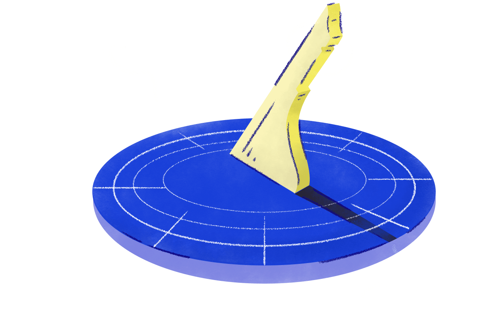
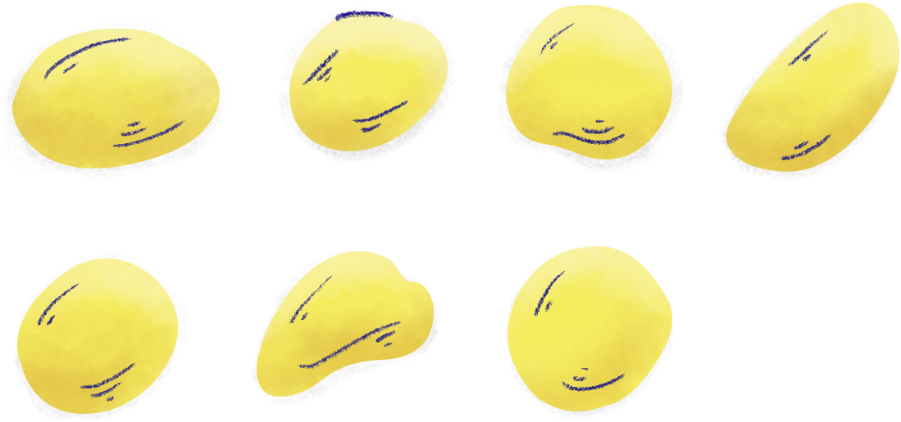

The projecting piece on a sundial that shows the time by the position of its shadow is called a Gnomon.

Gnomon, like "Hat", is just an English word, it's not a specific term for a piece
of sundial's anatomy. For example, Gnomon is also the word the Greeks used for odd
numbers. Possibly because of the following observation.

If you were to take an odd number of things, say 7 pebbles, and lay them out in two rows…

... you will notice a pebble projecting out of an otherwise even shape. Forming a Gnomon.
