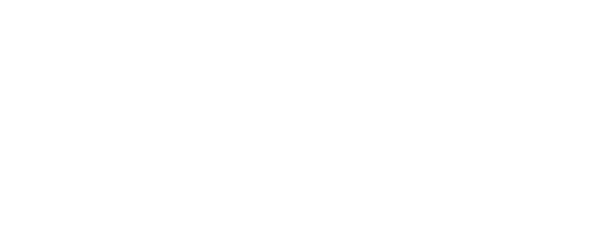

import Callout from "../../components/In Chapter/Callout"

The difference between normal solutions and recursive ones is that of foresight and trust. Generally, while coming up with a non-recursive solution, your thought process knows the exact steps and where those steps lead to, that's foresight. Whereas, in recursion, you have to, to some degree rely on trusting the process, because you can't–realistically–trace the complete execution of the program in your head.

In all the recursive functions we have written so far, whether it's `factorial`, `getFibTerm` or `isOdd`, it's difficult, and with a greater magnitude of parameters,  close to impossible to foresee exactly how the function is going to unfold and reveal an answer. Even if you were, with some minor difficulties able to trace their execution, as the examples will grow complex you will find yourself losing that foresight and the ability to trace the execution, and it'll be frustrating.

That is why this chapter is important, it'll help you learn to trust. That even though you cannot trace or see how a recursive function will arrive at a solution, you can trust that it will. Given, that you have the correct recursive insight.

The problem we're going to explore in this chapter has no computational utility, it's not an algorithm that makes your online transactions smoother or makes memes load faster. It exists entirely to help develop your trust in the recursive process.

Now that I have warmed you up with four bland paragraphs. Let's jump right into the problem!

Here's the setup.

We have 8 discs, 8 is an arbitrarily chosen number by me because it's nice and even and round, it could be any other number and the problem would still function. So again, we have 8 discs.


And we have 3 spires. Those things you see below with a round base and a rod sticking out? Those are our spires - A, B, and C. One important thing to notice is that the discs have holes in the center so that they can be slid on the spires.


The 8 discs, as apparent from the first image, are of different sizes, each slightly bigger than the other so that when stacked neatly on a spire, they form a pyramid. 

To begin with, the 8 discs are stacked on the first spire, or on Spire A.


Our task is to move the pyramid a.k.a the tower a.k.a the stack of discs from Spire A to Spire B…


...while, and this is important, not breaking the following 2 rules.


1. We can only move one disc at a time.
2. While moving, we cannot in any condition place a bigger disc on top of a small one.

Now an obvious question here is if the task is to move the stack of discs from
one spire to the next, why are there *3* spires?


There's no easy way to explain that, except with an example. And before we start, the program we're going to write will of course not animate the solution in the form of discs flying between spires, but rather, quite disappointingly so, write the steps of the solution in your browser's console. You'll see what the steps look like in a bit.

Now to account for the existence of a third spire. Let's consider an example where 2 discs are stacked on Spire A.


To move this stack of 2 discs from Spire A to Spire B **while respecting the two rules**, the steps we need to follow are:

<b><u>Step 1</u></b>: Move disc from Spire A to Spire C.


<!-- This leaves us with the following state of Spires and Discs

 -->

<b><u>Step 2</u></b>: Move disc from Spire A to Spire B.


<b><u>Step 3</u></b>: Move disc from Spire C to Spire B.


And with those 3 steps, we have moved the stack of discs from Spire A to Spire B without breaking the two rules.


The steps of the solution above will be printed in the browser's console (by the function we're going to write in a while) like so:

```{javascript}
Move Disc: A to C
Move Disc: A to B
Move Disc: C to B
```

And, I don't know if I *really* need to say this explicitly but taking all the discs off of the first spire, laying them all on the ground, and rearranging them again on the destination spire is not a solution. We have to use the three spires and we have to shuffle the discs between them and we have to not break the two rules, we have to not act like complete idiots. It's the constraints that make this problem so interesting.

So yes, we were able to transfer the stack of discs in just 3 steps. It's because, and you might want to sit down for this, we had just 2 discs. As the number of discs will increase, the steps involved in shifting them will grow exponentially. To move a stack of 4 discs, there are 15 steps involved. To move a stack of 8 discs, 255. Yeah, it's kinda berserk, but stay with me.

It's evident from the steps that a third spire exists to temporarily hold the discs. It's a necessary part. It facilitates the solution, with just two spires we won't be able to complete the objective.

Notice that we're not numbering the discs in the steps, as in move disc 1 or disc 2 or disc 7. We are simply saying "Move Disc". The rule says we can only move one disc at a time. Therefore, when it's said "Move Disc: C to A", we know that we'll be moving the disc at the top of the Spire C to the top of Spire A. Hence, there's no need to uniquely identify each disc with a number.

Now time for a bigger set of discs, how about 8? Why don't you give it a try on paper? Try writing down the steps, Move Disc from A to B, then from A to C then C to A … e.t.c. e.t.c and eventually lose your mind and sanity. It's not so bad on this side of the fence, promise. But in all honesty, it's unreasonable to task the human mind to figure and write steps for discs any greater than 5. That's why we have computers and that's why we have code!

---

The point of this chapter is to teach you to trust the recursive process. And after enough warming up, we're here now, we can start. I am going to propose a solution to the discs problem, or like it's lovingly called in Computer Science circles, "The towers of Hanoi" problem or the "Brahma's Discs" problem.

Recall that I introduced the problem at the beginning of this chapter with 8 discs stacked on Spire A. Let's try and solve that, then later we will generalise the solution for any number of discs, not just 2 or 8.

Ready?

Okay!

With all the 8 discs stacked on Spire A, imagine if a certain *someone*, for us, **while also not violating any of the 2 necessary rules**, moved the 7 discs at the top of Spire A to Spire C, and left just one disc on Spire A.


Then, what *we* can do is move the remaining single disc from Spire A to Spire B. Remember that, moving a single disc isn't a violation of any of the rules.


Later, we ask the same, *someone*, that moved the 7 discs stack from A to C, to move the same stack from C to B.


And there it is! Our final desired state! All 8 discs stacked on top of Spire B.

"Okay Nash… but who is this *someone*?", you might ask.

This, *someone*, is the thing that we need to learn to trust.

---

Recursive programs work because the problems they work on are decomposable i.e. they can be broken down into smaller sizes and still be solved with the same exact steps.

Here's what I mean:

Look at the 2 discs problem that we solved earlier. In that problem, leaving just one disc behind, we took the rest of the stack (yes, just 1 disc tall) and transferred it to Spire C. Then, we moved the remaining one disc on Spire A to Spire B, and in the final step moved the rest of the stack- which was just one disc tall - from Spire C to B, and finally had the entire stack on Spire B. All of that without breaking any of the two rules.


If you think, even with just two of your many brain cells; you'll notice a stunning similarity between the solution for 2 discs and the solution we just went over for 8 discs.


Do you see it?

Pulling a common string from the two solutions can help us in proposing a general solution for an `n` number of discs, where `n` could be any integer greater than 1.

We'll write a function called `moveStack`, whose signature looks like this.

```javascript
function moveStack(n, fromSpire, toSpire, tempSpire) {}
```

`moveStack` takes in 4 parameters:
1. `n`: the number of discs to be moved.
2. `fromSpire`: The name of the spire on which the discs are currently stacked.
3. `toSpire`: The name of the destination spire, the spire to which discs stacked on `fromSpire` are supposed to be transferred to.
4. `tempSpire`: The name of the spire that is going to be used to temporarily hold the discs while they are transferred between `fromSpire` and `toSpire`.

Once we have filled in the `moveStack` function with the correct algorithm, executing ... 

```javascript
moveStack(8, 'A', 'B', 'C')
```

... will print the steps involved in moving a stack of `8` discs from a spire named 'A' to a spire named 'B' while using the spire named 'C' as the temporary spire.

Before writing the steps in JavaScript, let's write them down in English.

In case you have forgotten, here's a quick recap of the setup.

To begin with, the `n` discs are stacked on a spire we have name 'A', we could've named it Ahmed or Anita but A is a good enough name for a spire. Our goal is to move the stack of discs from Spire A (`fromSpire`) to Spire B (`toSpire`) while using Spire C (`tempSpire`) as the temporary spire .



With this setup, the steps involved in the general solution are:

<b><u>Step 1</u></b>: 

Take the stack of `n-1` discs from `fromSpire` and move it to *tempSpire*. (This will leave a single disc on `fromSpire`).


<b><u>Step 2</u></b>:

Take that single disc on `fromSpire` (From Spire) and move it to `toSpire`


<b><u>Step 3</u></b>:

Then, we'll move the stack with `n-1` discs on `tempSpire` (Temp Sire) to `toSpire`


<b><u>Step 4</u></b>: 

There's no step 4, we're done moving the stack!


Here's how everything looks when written in code, don't worry if it doesn't make sense in the first go, we'll break it down soon after the chunk of code you see below.

```javascript
function moveStack(n, fromSpire, toSpire, tempSpire) {
  // Base case
  if (n == 1) {
    moveSingleDisc(fromSpire, toSpire)
    return
  }
  // Step 1
  moveStack(n - 1, fromSpire, tempSpire, toSpire)
  // Step 2
  moveSingleDisc(fromSpire, toSpire)
  // Step 3
  moveStack(n - 1, tempSpire, toSpire, fromSpire)
  // Step 4
  // There's no step 4, we're done moving the stack!
}

function moveSingleDisc(fromSpire, toSpire) {
  // Print the step
  console.log("Move Disc:", fromSpire, " to ", toSpire)
}

// Execute the program and print the steps
moveStack(8, "A", "B", "C")
```

The only confusion landmine I am worried about, that can surprise you here is the ordering of parameters inside `moveStack` in `// Step 1` and `// Step 3`.

```javascript{1-2,5-6}
  // Step 1
  moveStack(n - 1, fromSpire, tempSpire, toSpire)
  // Step 2
  moveSingleDisc(fromSpire, toSpire)
  // Step 3
  moveStack(n - 1, tempSpire, toSpire, fromSpire)
```

That, took some extra brainpower for me to understand, from where I am I cannot reliably predict if you're stumped by the same confusion or if I am just a slight bit slower than an average person. But in any case, we'll try to minimize that confusion as we go.

Before we proceed, here's a working version of the whole program. Peep the console for the 255 steps involved in moving a stack of 8 discs.

https://codesandbox.io/s/snippet-1-1po5d?expanddevtools=1&fontsize=16&theme=dark

In the editor, try changing the value of `n` in `moveStack` from 8 to 2, you'll see that the 3 step solution we wrote earlier for 2 discs gets printed.

i.e.

```
Move Disc: A to C
Move Disc: A to B
Move Disc: C to B
```

---

It's deceptively simple how less than 10 lines of code are able to accomplish something seemingly impossible for the human brain, right? That's what Recursion feels like sometimes, you should get used to it.

If we peek at the innards of `moveStack`, it's just plain English so it shouldn't be that hard to wrap your head around it.

Here's the entire `moveStack` function without any comments. Take a second and marvel at its beauty, its short size and its humongous ability.

```javascript
function moveStack(n, fromSpire, toSpire, tempSpire) {
  if (n === 1) {
    moveSingleDisc(fromSpire, toSpire)
    return
  }
  moveStack(n - 1, fromSpire, tempSpire, toSpire)
  moveSingleDisc(fromSpire, toSpire)
  moveStack(n - 1, tempSpire, toSpire, fromSpire)
}
```

The first block we run into inside `moveStack` is a familiar one. It's the base case! It's here, it was there when we wrote `isEven`, `isOdd`, `getFibTerm`, `factorial`, god! we have already done so much together and we're only in Chapter 2, isn't that exciting?

```javascript{2-5}
function moveStack(n, fromSpire, toSpire, tempSpire) {
  // Base case
  if (n == 1) {
    moveSingleDisc(fromSpire, toSpire)
    return
  }
  moveStack(n - 1, fromSpire, tempSpire, toSpire)
  moveSingleDisc(fromSpire, toSpire)
  moveStack(n - 1, tempSpire, toSpire, fromSpire)
}
```

The base case, if you remember, is what stops the execution from going into an infinite loop. If that has slipped your mind, then, "a missing base case will make a ball dropped from the top of a staircase go into a portal and hit on the top of your head" should ring a bell.


Notice, how in each call we're reducing the value of `n` by `1`, so eventually `n` *will* become `1` and hit the base case and we *will* stop the repeated execution with a `return `.

```javascript{4,6,8}
function moveStack(n, fromSpire, toSpire, tempSpire) {
  if (n == 1) {
    moveSingleDisc(fromSpire, toSpire)
    return
  }
  moveStack(n - 1, fromSpire, tempSpire, toSpire)
  moveSingleDisc(fromSpire, toSpire)
  moveStack(n - 1, tempSpire, toSpire, fromSpire)
}
```

The other thing, as I mentioned before, is to pay attention to the different ordering of spire parameters in the first and second calls to `moveStack` inside `moveStack`. This is important, so follow closely.

When you execute `moveStack`, say like so:
``` javascript
moveStack(8, 'A', 'B', 'C')
```
The following values are assigned to `moveStack`'s parameters.
* `n` becomes 8.
* `fromSpire` becomes A
* `toSpire` becomes B, and 
* `tempSpire` becomes C


Now, if you remember the general solution, the **first** step was to slice the stack of discs leaving only one disc on `fromSpire` and transfer the remaining `n-1` discs to `tempSpire`, *this is why* the first call to `moveStack` inside `moveStack` has `toSpire` as the 3rd parameter because the stack of discs is being transferred between `fromSpire` and `tempSpire`


```javascript{6}
function moveStack(n, fromSpire, toSpire, tempSpire) {
  if (n == 1) {
    moveSingleDisc(fromSpire, toSpire)
    return
  }
  moveStack(n - 1, fromSpire, tempSpire, toSpire)
  moveSingleDisc(fromSpire, toSpire)
  moveStack(n - 1, tempSpire, toSpire, fromSpire)
}
```

And for a similar reason, since in the last step we're transferring stack from `tempSpire` to `toSpire` we have `fromSpire` as the third parameter.

```javascript{8}
function moveStack(n, fromSpire, toSpire, tempSpire) {
  if (n == 1) {
    moveSingleDisc(fromSpire, toSpire)
    return
  }
  moveStack(n - 1, fromSpire, tempSpire, toSpire)
  moveSingleDisc(fromSpire, toSpire)
  moveStack(n - 1, tempSpire, toSpire, fromSpire)
}
```

At this point, I am hoping with 3 :finger-crossed-emojis: that you have understood the reason behind the different ordering of spire parameters in the first and second calls to `moveStack`.

The next function we need to talk about is `moveSingleDisc`. All it does is it prints the step of moving a single disc from one spire to another to the console. That’s all!

```javascript
function moveSingleDisc(fromSpire, toSpire) {
  console.log("Move Disc:", fromSpire, " to ", toSpire)
}
```

---

After all the mayhem and madness we can quietly come back to *someone*, now isn’t that romantic? The *someone* we were imagining who would transfer the sliced stack with one less disc to the other spire was no one other than our function `moveStack` itself!! 

That reliance on *someone* is signified by the calls to `moveStack` *inside* `moveStack`


```javascript{3,5}
function moveStack(n, fromSpire, toSpire, tempSpire) {
  ...
  moveStack(n - 1, fromSpire, tempSpire, toSpire)
  ...
  moveStack(n - 1, tempSpire, toSpire, fromSpire)
}
```

And if you recall the "Give me this and I'll handle the rest" rule from the [first chapter](https://loving-recursion.co/chapter1), which now that I come to think of, is *quite* a verbose name. There's a trust in "Give me this..", which in `moveStack` is asking the program to move the stack without breaking the two rules and "...I'll handle the rest" is moving the single disc from `fromSpire` to `toSpire`.

And so is the case with “Give me this…” in `getFibTerm` or any of the other recursive function we have written previously. The *someone* we are asking to “give” is the function we are writing, isn’t it?

Let that sink in.

Because recursive problems are decomposable and a problem with a smaller size can be solved with the same exact steps, we can reuse the function we are writing. We let the program sequentially work on problems with smaller and smaller magnitudes, till it hits the base case and comes back with results that can be assembled together into the actual solution of the main problem.

<Callout>
When I say a problem with smaller size or magnitude here’s what I mean. 

For example, `factorial` function (which we wrote in the previous chapter) when executed with 5 spawns `factorial(4)`. Factorial working on 4 is the same problem, calculating  factorial of a number, but with a smaller magnitude i.e. 4 (4 < 5). `factorial(4)` spawns `factorial(3)` which is of even smaller size/magnitude. This goes on until the base case is hit and each spawn returns an answer which is later assembled into the final result of 5! = 120
</Callout>

This, spawning of multiple arms is not clearly visible from the surface, when you write `moveStack(n-1….` it’s not easy to see that it will go ahead and spawn another `moveStack` ...


...and that will spawn another one, and that in turn another one until the result is reached. The missing foresight is why we need to develop trust in the recursive process. Given, that our recursive insight works on a problem with a given magnitude it will also work on problems with smaller magnitudes.

<br/>

## Summary

The Towers of Hanoi problem is often a trip.  You look at the solution and think “Okay, this works.”,  “But good Heavens how?”. Something beautiful about this problem is that “good heavens how?” doesn’t vanish until you have properly understood the workings of recursion. So this problem becomes an acid test for someone’s understanding of the recursive process.

Though I hope you have passed the acid test, if there’s still confusion stuck like chocolate in the insides of your skull, take your time, move ahead in the book. Come back later, try to understand it again and let the aha moment hit you in all its pure glory.

