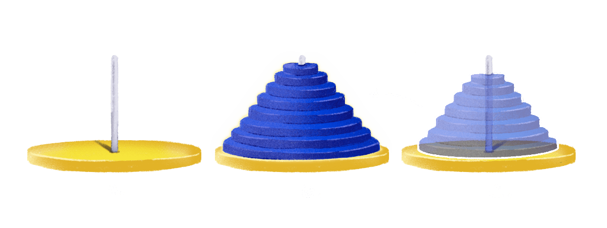

The difference between normal solutions and recursive ones is that of foresight and trust. Generally, while coming up with a non-recursive solution, your thought process knows the exact steps and where those steps lead to, that's foresight. Whereas, in recursion, you have to, to some degree rely on trusting the process, because you can't–realistically–trace the complete execution of the program.

Whether it's `factorial`, `getFibTerm` or `isOdd`. In all of these recursive functions, it's difficult, and with a greater magnitude of parameters - close to impossible to see exactly how the function is going to unfold and reveal an answer. Even if you were, with some minor difficulties able to trace their execution, as the examples will grow complex you will find yourself losing that foresight and the ability to trace the execution, and it'll be frustrating.

That is why this chapter is important, it'll help you learn to trust. That even though you cannot trace or see how a recursive function will arrive at a solution, you can trust that it will. Given, that you have the correct recursive insight.

The problem we're going to explore in this chapter has no computational utility, it's not an algorithm that makes your online transactions smoother or makes memes load faster. It exists entirely to help develop your trust in the recursive process.

Well, now that I have warmed you up with four bland paragraphs. Let's jump right into the problem!

Here's the setup.

We have 8 discs, 8 is an arbitrarily chosen number by me because it's nice and even and round, it could be any other number and the problem would still function. So again, we have 8 discs.


And we have 3 spires. Those things you see below with a round base and a rod sticking out? Yup! those are our spires - A, B, and C. One important thing to notice is that the discs have holes in the center so that they can be slid on the spires.


The 8 discs, as apparent from the first image, are of different sizes, each slightly bigger than the other so that when stacked properly on a spire, they form a pyramid. 

To begin with, the 8 discs are stacked on the first spire, or on Spire A.


Our task is to move the pyramid a.k.a the tower a.k.a the stack of discs from Spire A to Spire B…


...while, and this is important, not breaking the following 2 rules.


1. We can only move one disc at a time.
2. While moving, we cannot in any condition place a larger disc over the top of a small one.

Now an obvious question here is, if the task is to move the tower of discs from
one spire to the next, why the third spire?


There's no easy way to explain that, except with an example. And before we start, the program we're going to write will of course not animate the solution in the form of discs flying between spires, but rather, quite disappointingly so, write the steps of the solution in your browser's console. You'll see what the steps look like in a bit.

Let's consider an example where 2 discs are stacked on Spire A.


To move this tower (of 2 discs) from Spire A to Spire B **while also following the two rules**, the steps we need to follow are:

*Step-1*: Move disc from Spire A to Spire C.


<!-- This leaves us with the following state of Spires and Discs

 -->

*Step-2*: Move disc from Spire A to Spire B.


*Step-3*: Move disc from Spire C to Spire B.


And with those 3 steps, we have moved the stack of discs from Spire A to Spire B without breaking the two rules.


The steps of the solution above will be printed in the browser's console (by the function we're going to write in a while) like so:

```{javascript}
Move Disc: A to C
Move Disc: A to B
Move Disc: C to B
```

And, I don't know if I *really* need to say this explicitly but taking all the discs off of the first spire, laying them all on the ground, and rearranging them again on the destination spire is not a solution. We have to use the three spires and we have to shuffle the discs between them and we have to not break the two rules, we have to not act like complete idiots. It's the constraints that make this problem so interesting.

So yes, we were able to transfer the stack of discs in just 3 steps. It's because, and you might want to sit down for this, we had just 2 discs. As the number of discs will increase, the steps involved in shifting them will grow exponentially. To move a stack of 4 discs from spire A to B, there are 15 steps involved. To move a stack of 8 discs, 255. Yeah, it's kinda berserk, but stay with me.

It's evident from the steps that the third spire exists to temporarily hold the discs. It's a necessary part. It facilitates the solution, without it we won't be able to complete the objective and also not break the two rules.

Notice that we're not numbering the discs in the steps, as in move disc 1 or disc 2 or disc 7. We are simply saying "Move Disc". The rule says we can only move one disc at a time. Therefore, when it's said "Move Disc: C to A", we know that we'll be moving the disc at the top of the spire C to the top of spire A. Hence, there's no need to uniquely identify each disc with a number.

Now, time for a bigger set of discs, how about 8? Why don't you give it a try on paper? Try writing down the steps, Move Disc from A to B, then from A to C then C to A … e.t.c. e.t.c and eventually lose your mind and sanity. It's not so bad on this side of the fence, promise.

But in all honesty, it's unreasonable to task the human mind to figure and write steps for discs any greater than 5. That's why we have computers and that's why we have code!

---

The point of this chapter is to teach you to trust the recursive process. And after enough warming up, we're here now, we can start. I am going to propose a solution to the discs problem, or like it's lovingly called in Computer Science circles, "The towers of Hanoi" problem or the "Brahma's Discs" problem.

To begin with, we will go back to our original problem with 8 discs and then generalize the solution for any number of discs.

Ready?

Okay!

With all the 8 discs stacked on spire A, imagine if a certain *someone*, for us, **while also not violating any of the 2 necessary rules**, moved the 7 discs at the top of Spire A to Spire C, and left just one disc on Spire A.


Then, what we can do is move the remaining single disc from Spire A to Spire B. Remember that, moving a single disc isn't a violation of any of the rules.


Later, we ask the same, *someone*, that moved the 7 discs tower from A to C, to move the 7 discs tower from C to B.



And there it is! Our final desired state! All 8 discs stacked on top of Spire B.

"Okay Nash… but who is this *someone*?", you might ask.

This, *someone*, is the thing that we need to learn to trust.

Remember the rule I talked about in the first chapter? Now that I come to think of it, we could've given it a better name, but we're now stuck with "Give me this and I'll handle the rest" rule. And to quote me from the previous chapter:

> **There's a trust in "Give me this…"** which in this program is `getFibTerm(n-1)` and `getFibTerm(n-2)`. There's no easy way here to trace while writing that the program will return what you're asking of it, but you're trusting the program that it will. Then, comes the "…I'll handle the rest" part which is that if the program correctly gave what you asked of it, you'll do the required calculation, which in this example is adding the two terms together `getFibTerm(n-1) + getFibTerm(n-2)`.

Recursive programs work because the problems they work on are decomposable i.e. they can be broken down into smaller sizes and still be solved with the same exact steps.

Here's what I mean:

Look at the 2 discs problem that we solved earlier. In that problem, leaving just one disc behind, we took the rest of the tower (yes, just 1 disc tall) and transferred it to Spire C. Then, we moved the remaining one disc on Spire A to Spire B, and in the final step moved the rest of the tower - which was just one disc tall - to Spire B and finally had the entire tower on Spire B. All of that without breaking any of the two rules.

If you think, even with just two of your many brain cells; you'll notice a stunning similarity between the solution for 2 discs and the solution we proposed for 8 discs.

So, pulling a common string from the two solutions the steps involved in a general solution, given that we have `n` number discs (where `n` can be any integer greater than 1 ) stacked on Spire A, seems to be this:

1. Take the tower of `n-1` discs and move it to spire C. (This will leave a single disc on spire A).
2. We'll take that single disc on spire A and move it to spire B.
3. Then, we'll move the tower with `n-1` discs on spire C to spire B.
4. There's no step 4, we're done moving the tower of n discs from spire A to spire B.

Notice I said `n` can be any number *greater than 1*, it's because we don't need a solution to move a single disc from Spire A to Spire B. It's just - pick up the disc and place it there! And this, (hint hint) can become the base case of our general recursive solution.

If we were to write all of that in code, here's what it will look like.

```javascript
function moveTower(n, startSpire, endSpire, tempSpire) {
  if (n == 1) {
    moveSingleDisc(startSpire, endSpire)
    return
  }
  // Step 1
  moveTower(n - 1, startSpire, tempSpire, endSpire)
  // Step 2
  moveSingleDisc(startSpire, endSpire)
  // Step 3
  moveTower(n - 1, tempSpire, endSpire, startSpire)

  // 4. There's no step 4, 
  // We're done moving the tower of n discs from spire A to spire B.
}

function moveSingleDisc(startSpire, endSpire) {
  // Print the step
  console.log("Move Disc:", startSpire, " to ", endSpire)
}

// Execute the program and print the steps
moveTower(8, "A", "B", "C")
```

Feeling lost?

Don't.

Let's start with the two extreme lines in the code block.

```javascript{1,9}
function moveTower(n, startSpire, endSpire, tempSpire) {
  ...
}

function moveSingleDisc(startSpire, endSpire) {
  ...
}

moveTower(8, 'A', 'B', 'C');
```

The function `moveTower` takes in 4 parameters:
1. `n`: the number of discs stacked on the starting spire.
2. `startSpire`: The name of the spire on which discs are stacked initially (we're using the name `A` for `startSpire`).
3. `endSpire`: The name of the destination spire, where the discs stacked on the `startSpire` are supposed to be transferred to (we've named the `endSpire` `B`).
4. `tempSpire`: The name of the spire that facilitates the solution, or, temporarily holds the discs (in our case we've given it the name `C`)

Ignoring the unimaginative spire names, when we execute `moveTower(8, 'A', 'B', 'C')`, it's asking the computer to move a stack of 8 discs stacked on spire 'A' to spire 'B' while using spire 'C' to temporarily hold the discs. And the computer does exactly what it's asked to. The program written above works and prints out the two hundred and fifty-five steps involved in moving an 8 disc tower to Spire B without breaking the 2 aforementioned rules. You can execute the program, follow the steps and see it for yourself!

https://codesandbox.io/embed/snippet-1-1po5d?expanddevtools=1&fontsize=16&theme=dark

Try changing the value of n in moveTower from 8 to 2, you'll see that the 3 step solution we wrote earlier for 2 discs gets printed.

---

It's deceptively simple how less than 10 lines of code are able to accomplish something seemingly impossible for the human brain, right? That's how Recursion feels like sometimes, get used to it.

If we peek at the innards of `moveTower`, it's just plain English so it shouldn't be that hard to wrap your head around it.

Here's the entire `moveTower` function without any comments. Take a second and marvel at its beauty.

```javascript
function moveTower(n, startSpire, endSpire, tempSpire) {
  if (n === 1) {
    moveSingleDisc(startSpire, endSpire)
    return
  }
  moveTower(n - 1, startSpire, tempSpire, endSpire)
  moveSingleDisc(startSpire, endSpire)
  moveTower(n - 1, tempSpire, endSpire, startSpire)
}
```

The first block we run into is a familiar one. It's the base case! It's here, it was there when we wrote `isEven`, `isOdd`, `getFibTerm`, `factorial`, god! we have already done so much together and we're only in Chapter 2, isn't that exciting?

```javascript{2-5}
function moveTower(n, startSpire, endSpire, tempSpire) {
  // Base case
  if (n == 1) {
    moveSingleDisc(startSpire, endSpire)
    return
  }
  moveTower(n - 1, startSpire, tempSpire, endSpire)
  moveSingleDisc(startSpire, endSpire)
  moveTower(n - 1, tempSpire, endSpire, startSpire)
}
```

The base case, if you remember, is what stops the execution from going into an infinite loop. If that has slipped your mind, then "a missing base case will make a ball dropped from the top of a staircase go into a portal and hit on the top of your head" should ring a bell.


Notice, how in each call we're reducing the value of `n` by `1`, so eventually `n` *will* become `1` and hit the base case and we *will* stop the repeated execution with a `return `.

```javascript{4,6,8}
function moveTower(n, startSpire, endSpire, tempSpire) {
  if (n == 1) {
    moveSingleDisc(startSpire, endSpire)
    return
  }
  moveTower(n - 1, startSpire, tempSpire, endSpire)
  moveSingleDisc(startSpire, endSpire)
  moveTower(n - 1, tempSpire, endSpire, startSpire)
}
```

The other thing to pay attention to is the different sequence of spire parameters ordering in the first and second calls to `moveTower` inside `moveTower`. This is important, so follow closely, that Instagram DM can wait.

When you execute `moveTower`, say like so:
``` javascript
moveTower(8, "A", "B", "C")
```
The following values are assigned to `moveTower`'s parameters.
* `n` becomes 8.
* `startSpire` gets the name A.
* `endSpire` becomes B, and
* `tempSpire` becomes C.

Now, if you remember the general solution, the first step was to slice the tower of discs leaving only one disc on Spire A and transfer the remaining `n-1` discs to Spire C, correct?

Which, in code is `moveTower(n-1, 'A', 'C', 'B')`. Again, we're moving from A to
C in this step hence our start spire is A and our ending spire is C (as opposed to B). And that's exactly why we have the first call to `moveTower` inside `moveTower` as:

```javascript{6,7}
function moveTower(n, startSpire, endSpire, tempSpire) {
  if (n == 1) {
    moveSingleDisc(startSpire, endSpire)
    return
  }
  // startSpire = A, tempSpire = C, endSpire = B
  moveTower(n - 1, startSpire, tempSpire, endSpire)
  moveSingleDisc(startSpire, endSpire)
  moveTower(n - 1, tempSpire, endSpire, startSpire)
}
```

It's very easy to get confused here with the different ordering of parameters so DO NOT move beyond this point unless you understand it fully.

Alright?…

…hoping that you *did*, the next function is `moveSingleDisc`. All it does is it prints the step of moving a disc from one spire to another to the console. That’s all!

```javascript
function moveSingleDisc(startSpire, endSpire) {
  console.log("Move Disc:", startSpire, " to ", endSpire)
}
```

And in the end, the final step is of moving the sliced tower we put on spire C to spire B.


```javascript
  // tempSpire = C, endSpire = B, startSpire = A
  moveTower(n - 1, tempSpire, endSpire, startSpire)
```

And thus, the pyramid is is transferred where it’s supposed to be transferred.

After all the mayhem and madness we can quietly come back to *someone*, now isn’t that romantic? The *someone* we were imagining who would transfer the sliced tower with one less disc to the other spire was no one other than our function `moveTower` itself. 

*cue mind-blown emoji*

🤯

---
[Code highlighting moveTowers inside moveTower]

And so is the case with “Give me this…” in `getFibonacciNumber` or any of the other recursive functions we have written previously. The someone we are asking to “give” is the function we are writing, isn’t it?

Let that sink in.

Because recursive problems are decomposable and a problem with a smaller size can be solved with the same exact steps, we can reuse the function we are writing. We let the program sequentially work on problems with smaller and smaller magnitudes, till it hits the base case and comes back with results that can be assembled together into the actual solution of the main problem.

Aside:
When I say a problem with smaller size or magnitude here’s what I mean. For example  `factorial` when executed with 5 spawns `factorial(4)`. 

Factorial working on 4 is the same problem, calculating  factorial of a number, but with a smaller magnitude i.e. 4 (4 < 5). `factorial(4)` spawns `factorial(3)` which is of even smaller size/magnitude. This goes on until the base case is hit and each spawn assembles and answer which is later assembled into the final result of 5! = 120

[ART]

This, spawning of multiple arms is not clearly visible from the surface, when you write `moveTower(n-1….` it’s not easy to see that it will go ahead and spawn another `moveTower` and that will spawn another one, and that in turn another one until the result is reached. The missing foresight is why we need to develop trust in the recursive process. Given, that our recursive insight works on a problem with given magnitude it will also work on problems with different and smaller magnitudes.


## Summary

The Towers of Hanoi problem is often a trip.  You look at the solution and think “Okay, this works.”,  “But good Heavens how?”. Something beautiful about this problem is that “good heavens how?” doesn’t vanish until you have properly understood the workings of recursion. So this problem, becomes an acid test for someone’s understanding of the recursive process.

Though I hope you have passed the acid test, if there’s still confusion stuck like chocolate bar in different insides of your skull, take your time, move ahead in the book. Come back later, try to understand it again and let the aha moment hit you in all its pure glory.

