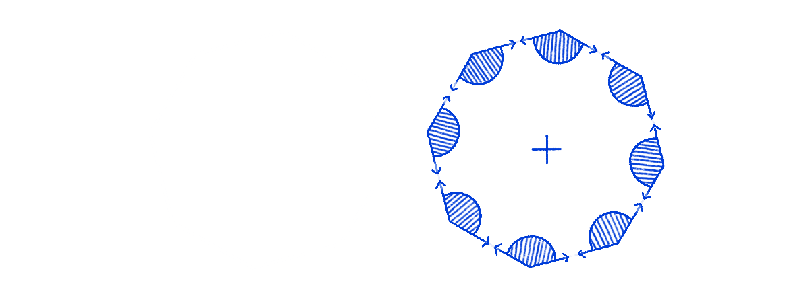
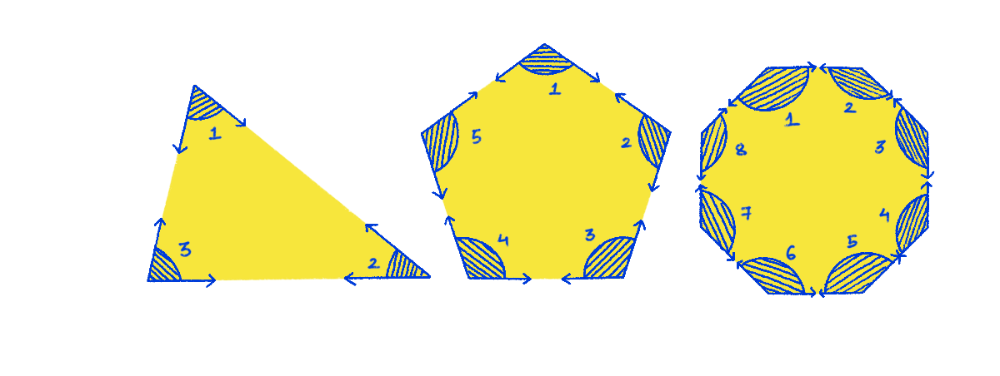
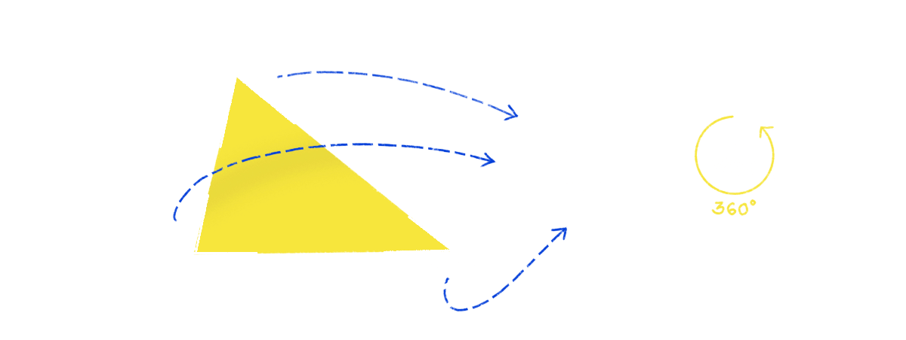
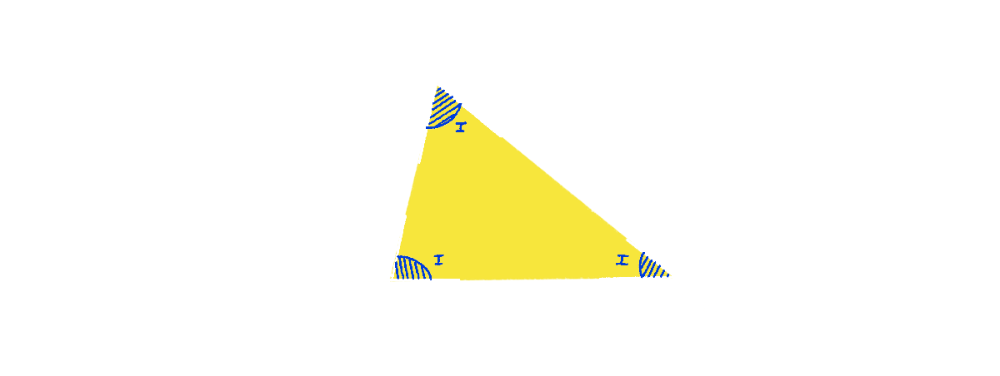
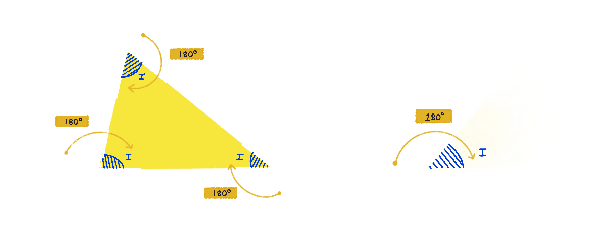
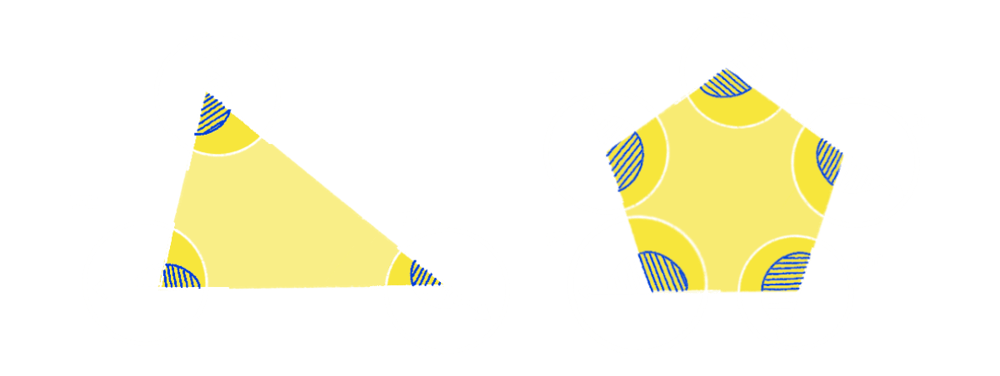
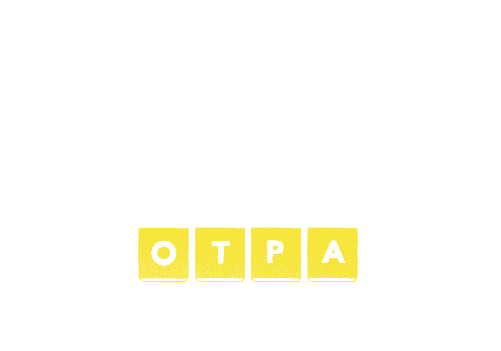
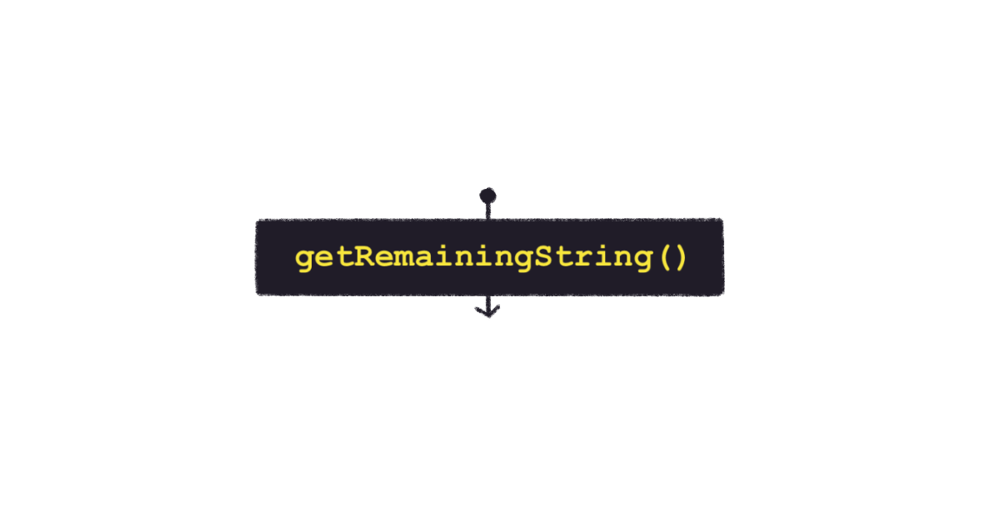
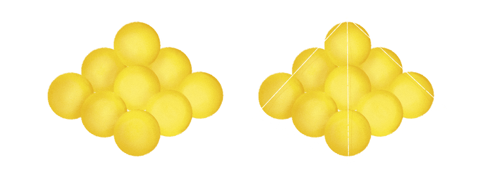

import Callout from "../../components/In Chapter/Callout"

Introducing the *next* chapter in the first paragraph of the chapter that you're writing, isn't the best of ideas. But I CAN'T WAIT to tell you that in the coming chapter we will learn how to draw using Math and JavaScript.

Since drawing with Math is going to be so exciting and consuming, you could lose touch with everything we have learned so far. Therefore, as the last polish to the tools we have collected, we'll solve one more example before proceeding to Math and drawing or, "Graphical Recursion".

The problem that we're going to write a recursive solution for in this chapter is a simple one. The problem of reversing a word. Since when did reversing words become a problem? I don't know, it's not a pressing global problem just a computer science/mathematics problem.

Like we've been doing in the book so far, we'll use JavaScript to write the solution to this problem. If you're using any other programming language, the string manipulation methods that you'll see me using might not be available in that particular language. So it's up to you to either use a library or best, figure everything out yourself.

And now, to the problem.

So we've got a word, say LAPTOP, which we want to reverse. A reversed LAPTOP becomes?...

POTPAL 

Do you see what reversing a word is?

The non-recursive way of reversing a word is to begin by picking the extreme letters, switching their positions, and then incrementally moving in from both sides and switching positions of the remaining letters one by one.


The recursive solution is along the same lines, but it's going to be a lot more elegant. Before reading further, if you could attempt the solution yourself, that would make papa Nash super happy.

---

As you set off on this new adventure of yours, thinking and grappling, I would like to talk to you about something, if I have your permission.

Sometimes you see, I dream of living in a world where it's legal to use a rule, a procedure, or a formula only if you know how/why that formula works. I also dream about a world where cafè latte pours out of sink taps as soon as you walk into the kitchen.

Take the polygon below for example, what's the sum of its interior angles (shown in blue and called so because they are *inside* the polygon)?



"That's a very random question!", I know, but play along.

Here's the formula to calculate the sum of interior angles of a polygon. But because I don't want to be writing "Sum of interior angles of a polygon" or, "Number of sides in a polygon" over and over again, we need to agree on some nomenclature first. We will use:
1. `S-I` for Sum of interior angles, and
2. `N` for Number of sides in a polygon

Coming back to the formula, here's how it goes:

$$
\textnormal{S-I} = 180^\circ \times (\textnormal{N} - 2)
$$

Count the number of sides, plug it into the formula, and off you go with the correct answer.

Since the polygon shown above has 8 sides, we can plug in 8 into the formula to get the sum of its interior angles.

$$
\textnormal{S-I} = 180^\circ \times (8 - 2) \\
\Rightarrow 180^\circ \times 6 \\
\Rightarrow 1080^\circ
$$

Cool, right?

Fast and easy, huh?

It has been observed - as David Epstein in his book Range points out - that in educationally high-performing countries, students are engaged more in "making connections" questions than in "using procedures" questions. To look at a polygon, count its sides, plug in the number and run off with the correct answer is a "using procedure" pattern. But, if I was to take the formula for calculating the sum of interior angles away from you and leave you out in the wild to cobble, struggle and figure an answer for yourself, that would be a "making connections" pattern.

> When students bring home problems that force them to make connections, Richland told me, "parents are like, 'let me show you a easier way'" . [The parents] are not good at seeing bewildered kids. But, with learning that is both durable and flexible fast and easy is precisely the problem. - From [Range (David Epstein)](https://www.goodreads.com/book/show/41795733-range)

A polygon has as many interior angles as its number of sides. A pentagon has 5 sides and 5 interior angles, an octagon has 8 sides and 8 interior angles and a triagon has 3 of both. (Sign the petition to rename triangle to triagon at your neighborhood Mathematician's house today!)



The other type of angles polygons have are called exterior angles. They are the angles between one side extended in length and the outside of the adjacent side.

These are the three exterior angles in a triangle.


The cool thing about exterior angles is that if you club them together they'd form a whole 3 hundred and 60 degrees.



In any other polygon, square for example, the exteriors also sum up to 360 degrees, and in a pentagon too, and also in a hexagon and any other -gon. Because in any polygon it is possible to arrange the sides to look as if they are originating from one point. And when you follow along summing up the angles you realise that they form a circle, and what's a full circle angle? Correct! 360 degrees.


From here we deduce that the sum of exterior angles of any polygon is always equal to 360 degrees.

Hang on to this deduction, and if you please, call it -- Deduction 1. Because what is Math if not an excuse to sound smart.

---

Now if we were to take a triangle (or any polygon for that matter), we can make a few observations about interior (blue) and exterior (white) angle pairs.



The first observation is that, a given pair of exterior and interior angles lie on a straight line. Which means the sum of each of  these pairs is equal to 180 degrees.



Another quite rudimentary observation is that the number of pairs of exterior + interior angles in a polygon is equal to the number of sides it has.

In a triangle we have three pairs of angles, if we had a pentagon with PENT sides, we'd have 5 pairs of angles with each pair adding up to 180 degrees. 



From these two observations, and make sure you get it, we can say,

$$
\textnormal{Sum of all interior angles (S-I)} + \textnormal{Sum of all exterior angles (S-E)} = \\
\textnormal{Number of I-E angle pairs} \times 180^\circ
$$

Now one thing we have already made abundantly clear is that the Sum of all exterior angles is 360 degrees - (From Deduction 1)

And 360 can be written as,

$$
360 = 180 \times 2
$$

Therefore,

$$
\textnormal{S-I} + (2 \times 180^\circ) = \textnormal{Number of I-E angle pairs} \times 180^\circ
$$

Now number of Interior Exterior angle pairs is same as the number of sides in a polygon.

So, for any polygon,

$$
\textnormal{S-I} + (2 \times 180^\circ) = \textnormal{N} \times 180^\circ
$$

With some shifting around the equals sign we can say,

$$ 
\textnormal{S-I} + (2 \times 180^\circ) = \textnormal{N} \times 180^\circ \\
\Rightarrow \textnormal{S-I} = (\textnormal{N} \times 180^\circ) - (2 \times 180^\circ) \\
\Rightarrow \textnormal{S-I} = 180^\circ \times (\textnormal{N} - 2)
$$

And now you know from where the formula in which you can plug in the number of sides and be handed the answer came from. When you understand why a formula works, it sticks better and for longer.

So much to say that if you're writing recursive solutions, or reading recursive solutions, what's important is not just identifying the rules. Rules are handy, they're quick, they're great, they're like little beautiful mathematical poems but, the real reward is in understanding why the rules work. Understanding forces you to make connections between concepts. Connections you would have not discovered if you had simply followed a procedure.

As you move forward in the book, I hope you keep this in mind and eventually also dream about a world where it's illegal to use a rule without knowing how it actually works. Because, like Socrates put it "…to fully understand, and engage with ideas, we need to understand where they come from…".

---

Well, well, well guess who forgot that we are reading a book about recursion?

Hoping that you took a stab at writing a recursive solution for reversing a word, here's the actual solution.
Let's start with the "Give me this, and I'll handle the rest" rule and see how it fits in this scenario.

Imagine if *someone* was to reverse the insides of the word for us (Give me this ...).



All that we'll have to do is switch the position of the letters at the first and the last positions. `L` and `P` in the case of the word LAPTOP (...I'll handle the rest).


... and there you have it! A reversed word!

We'll call our function `reverseString`. `reverseString` takes in a string or a word as an argument, recursively reverses it, and returns the reversed version of the string.

Here it is, and it's beautiful.

```javascript
function reverseString(string) {
  // Base case
  if(string.length <= 1) return string;
  // Get the first letter
  let firstLetter = string[0];
  // Get the last letter
  let lastLetter = string[string.length - 1]
  // Get the string that remains after removing first and last letters
  let remainingString = getRemainingString(string);

  return lastLetter + reverseString(remainingString) + firstLetter;
}
```

https://codesandbox.io/s/reversestring-nqxp1?fontsize=14&hidenavigation=1&theme=dark

Let's start breaking it down. First is the base case, which we will get to in a bit. Beyond that, the retrieval of `firstLetter` and `lastLetter` is straightforward, we're just picking characters at the first (`[0]`) and the last (`[string.length - 1]`) indices of the string that is passed as the argument.

Notice we also have the method `getRemainingString`, the task of `getRemainingString` is to return the string that remains after you remove the first and last letters/characters from it. 



To do that we're using JavaScript's [`String.prototype.slice`](https://developer.mozilla.org/en-US/docs/Web/JavaScript/Reference/Global_Objects/String/slice) method.

```javascript
//Returns the portion of string after removing the first and the last letters 
function getRemainingString(string) {
  return string.slice(1, -1);
}
```

<br/>

<Callout>

A special thing about `.slice` is that it also accepts negative numbers as parameter. When it notices a negative number, to keep everything within the bound of indices, it adds that number to the length of the original string, 

For example, the length of the string “LAPTOP” is 6, therefore, `LAPTOP.slice(-1)` is equivalent to `LAPTOP.slice( 6+ (-1))` which is same as `LAPTOP.slice(5)`, which returns the character at the fifth index - `P`. Which means you can also retrieve `lastLetter` as: 

```
let lastLetter = string.slice(-1)
```

In a similar fashion `string.slice(1, -1)` starts slicing the string from 1 to -1. -1 is converted to a positive number by adding it to the length of the string. Therefore `LAPTOP.slice(1, -1)` is equivalent to `LAPTOP.slice(1, 6 + (-1))` = `LAPTOP.slice(1, 5)` = “APTO”. And that is how `getRemainingString` returns the slice of the passed in string without the first and the last letters.

</Callout>

We can move to the next line, which essentially is the "..I'll handle the rest" part. What we're doing here is taking the first and last letters and switching their positions around *reversed* `remainingString`.

```javascript
return lastLetter + reverseString(remainingString) + firstLetter;
```
Notice how `lastLetter` is at the beginning of the sentence and `firstLetter` is at the end. Also notice we're calling `reverseString` inside `reverseString`, making the function recursive.

Now for the base case. To figure what the base case should be, always start by noticing what's changing in each call. With `reverseString`, it's the parameter string of course. With every call, we're removing two letters and hence the length of the string parameter is decreasing and will eventually become 0 or 1. That is exactly where our base case is.

The reversed version of a string of 0 or 1 characters is simply the string itself. Didn't get it? Here's a string "a", what do you get when you reverse it? "a" right? That's what I am talking about.

When the length of string becomes 0 or 1, we hit our base case and stop the execution by simply returning the string.

```javascript{2,3}
function reverseString(string) {
  // Base case
  if(string.length <= 1) return string;
  let firstLetter = string[0];
  let lastLetter = string.slice(-1);
  let remainingString = getRestString(string)

  return lastLetter + reverseString(remainingString) + firstLetter;
}
```

Now if you execute the function, you'll see the reversed string printed to the console.

```javascript
console.log(reverseString('LAPTOP'); // POTPAL
```

By now you should be in the early stages of developing the recursive lens and identifying the 3 crucial parts of a recursive solution. The base case, the trust in the solution a.k.a "Give me this, and I'll handle the rest" and calling of the function inside the function itself.

At this stage, having a little itch to solve another problem recursively is normal. I know you must be feeling full with ammo and arsenal ready to tackle your next recursive problem, so I am going to give you one. The problem is of counting cannonballs. I'll define the problem here in a bit, and we'll get back to solving it together after the next two chapters. 

In the next two chapters, we'll delve into something a little different from what we've been doing so far. In the two chapters that follow you'll learn Maths and HTML5 canvas and you'll draw recursive art in your browser window.

Until then, I'll leave you with the cannonballs problem.

What you have is a number of spherical cannonballs stacked to form a pyramid with a **square** base (remember, square base). Your job is to write a recursive function that takes in the height of the pyramid as the only argument and returns the number of cannonballs in that pyramid.

For example, say we have a pyramid of height 3


Don't get fooled by just the front view of the pyramid, it's actually 3 dimensional. Each of the 3 layers of the pyramid is made up of cannonballs like so:


When all of these 3 layers are stacked on top of each other, a pyramid is formed



The program you will write will recursively calculate the number of cannonballs in the pyramid of a given height. By height what I mean is number of layers of cannonballs stacked in that pyramid. In the above example the pyramid has 3 layers, hence it's of height 3.

And the pyramid of height 3, if you count, has 14 cannonballs.


How many cannonballs will a pyramid of height 7 contain? and of height 10? Your recursive function should calculate the number of cannonballs in the pyramid of *any* given height. 

Here's a hint, since the pyramid is of a square base, it's easy to figure out the number of cannonballs in any given layer.

<br/>

## Summary

This chapter was all about revisiting and polishing the heuristics that we have used to write all our recursive functions. Once you have the heuristics and the basic understanding taken care of, we can move on to more advanced concepts, which I probably don't need to mention again because my eager self has already leaked that information multiple times in this same chapter. 

It's time to move on to Graphical Recursion.

<Callout>
Want to read the next chapter early? Or help me review and write it? I have made a discord server where I plan to post progress on the next chapter and also share PDFs for early review. If that's something you're interested in, <a href="https://discord.gg/raavDEMEgs">come hang!</a>
</Callout>